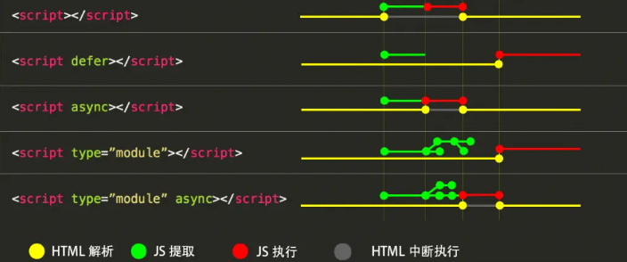

# 25.Module的加载机制

## 浏览器加载

### 传统方法

```html
<!-- 页面内嵌的脚本 -->
<script>
  // module code
</script>

<!-- 外部脚本 -->
<script src="demo.js"></script>
```

上面这种情况是同步加载脚本，即渲染引擎遇到&lt;script&gt;标签就会停下来，等到执行完脚本，再继续向下渲染。如果是外部脚本，还必须加入脚本下载的时间。如果脚本很大，下载和执行事件就会很长，会导致浏览器阻塞，白屏时间变长，用户体验很差。因此，浏览器可以异步加载脚本。

```html
<script src="demo.js" defer></script>
<script src="demo.js" async></script>
```

- defer 或 async 属性，脚本就会异步加载。渲染引擎遇到这一行命令，就会开始下载外部脚本，但不会等它下载和执行，而是直接执行后面的命令。
- defer 与 async 的区别是：一句话，defer 是“渲染完再执行”，async 是“下载完就执行”。所以，async 可能在 DOMContentLoaded 事件触发前或之后执行 ，defer 是在浏览器将在文档完成解析后 DOMContentLoaded 事件触发前执行。另外，如果有多个 defer 脚本，会按照它们在页面出现的顺序加载，而多个 async 脚本是不能保证加载顺序的。
- 如果两个属性同时存在的话，async 的优先级更高

#### 拓展
脚本的加载顺序


### ES6 模块

```html
<script type="module">
  // 模块代码
  import { Max } from "./math.js";
  console.log(Max(1, 2, 7, 2, 0)); //7
</script>
<!-- 等价与 -->
<script type="module" defer>
  // 模块代码
  import { Max } from "./math.js";
  console.log(Max(1, 2, 7, 2, 0)); //7
</script>

<script type="module" src="demo.js"></script>
<!-- 等价与 -->
<script type="module" src="demo.js" defer></script>
```

- 浏览器对于带有`type="module"`的&lt;script&gt;，都是异步加载(内嵌和外部脚本都是)，不会造成堵塞浏览器，即等到整个页面渲染完，再执行模块脚本，等同于打开了&lt;script&gt;标签的 defer 属性。
- 如果网页有多个&lt;script type="module"&gt;，它们会按照在页面出现的顺序依次执行
- 如果此时加上 async，则表示只要脚本加载完成，渲染引擎就会中断渲染立即执行。执行完成后，再恢复渲染，此时就无法保证模块的执行顺序。

### 注意事项

- 代码是在模块作用域之中运行，而不是在全局作用域运行。模块内部的顶层变量，外部不可见。
- 模块脚本自动采用严格模式，不管有没有声明 use strict。
- 模块之中，可以使用 import 命令加载其他模块（.js 后缀不可省略，需要提供绝对 URL 或相对 URL），也可以使用 export 命令输出对外接口。
- 模块之中，顶层的 this 关键字返回 undefined，而不是指向 window。也就是说，在模块顶层使用 this 关键字，是无意义的。
- 同一个模块如果加载多次，将只执行一次。

```js type="module"
import utils from "https://example.com/js/utils.js";

const x = 1;
console.log(x === window.x); //false
console.log(this === undefined); // true
//利用顶层的this等于undefined这个语法点，可以侦测当前代码是否在 ES6 模块之中。
const isNotModuleScript = this !== undefined;
```

## Node.js 加载 ES6 模块

### ES6 模块与 CommonJS 模块的差异

> 讨论 Node.js 加载 ES6 模块之前，需要了解 ES6 模块与 CommonJS 模块的差异。
> 三个重大差异:

```md
- CommonJS 模块输出的是一个值的拷贝，ES6 模块输出的是值的引用。
- CommonJS 模块是运行时加载，ES6 模块是编译时输出接口。
- CommonJS 模块的 require()是同步加载模块，ES6 模块的 import 命令是异步加载，有一个独立的模块依赖的解析阶段。
```

#### 第一大差异

CommonJS 模块输出的是值的拷贝，也就是说，一旦输出一个值，模块内部的变化就影响不到这个值。

```js
// lib.js
var counter = 3;
function incCounter() {
  counter++;
}
module.exports = {
  counter: counter,
  incCounter: incCounter,
};
```

上面代码输出内部变量 counter 和改写这个变量的内部方法 incCounter。然后，在 main.js 里面加载这个模块。

```js
// main.js
var mod = require("./lib");

console.log(mod.counter); // 3
mod.incCounter();
console.log(mod.counter); // 3
```

上面代码说明，lib.js 模块加载以后，它的内部变化就影响不到输出的 mod.counter 了。这是因为 mod.counter 是一个原始类型的值，会被缓存。除非写成一个函数，才能得到内部变动后的值。

```js
// lib.js
var counter = 3;
function incCounter() {
  counter++;
}
module.exports = {
  get counter() {
    return counter;
  },
  incCounter: incCounter,
};
```

上面代码中，输出的 counter 属性实际上是一个取值器函数。现在再执行 main.js，就可以正确读取内部变量 counter 的变动了。

```bash
$ node main.js
3
4
```
```js
//在评论里看到这样一个例子（lib的代码是改写后用取值器的代码）
var counter = require('./lib.js').counter;
var incCounter = require('./lib.js').incCounter;
var lib = require('./lib.js');

console.log(counter); // 3
incCounter();
console.log(counter); // 3

console.log(lib.counter); // 4
incCounter();
console.log(lib.counter); // 5
//之所以第二个打印还是3，就是因为输出的counter是值（已经脱离取值器了），没有办法和原始库绑定关系。后面子所以能取到最新值，就是因为有取值器，现取
```

ES6 模块的运行机制与 CommonJS 不一样。JS 引擎对脚本静态分析的时候，遇到模块加载命令 import，就会生成一个只读引用。等到脚本真正执行时，再根据这个只读引用，到被加载的那个模块里面去取值。换句话说，ES6 的 import 有点像 Unix 系统的“符号连接”，原始值变了，import 加载的值也会跟着变。因此，ES6 模块是动态引用，并且不会缓存值，模块里面的变量绑定其所在的模块。

```js
// lib.js
export let counter = 3;
export function incCounter() {
  counter++;
}

// main.js
import { counter, incCounter } from "./lib";
console.log(counter); // 3
incCounter();
console.log(counter); // 4
```

例子二

```js
// m1.js
export var foo = "bar";
setTimeout(() => (foo = "baz"), 500);

// m2.js
import { foo } from "./m1.js";
console.log(foo);
setTimeout(() => console.log(foo), 500);
```

运行`m2.js`

```bash
$ node m2.js

bar
baz
```

上面代码表明，ES6 模块不会缓存运行结果，而是动态地去被加载的模块取值，并且变量总是绑定其所在的模块。

由于 ES6 输入的模块变量，只是一个“符号连接”，所以这个变量是只读的，对它进行重新赋值会报错。(虽然看下面的代码 obj 是用 let 声明的，但是只可读，不可改)

```js
// lib.js
export let obj = {};

// main.js
import { obj } from "./lib";

obj.prop = 123; // OK
obj = {}; // : Assignment to constant variable.
```

export 通过接口，输出的是同一个值。不同的脚本加载这个接口，得到的都是同样的实例。

```js
// mod.js
function C() {
  this.sum = 0;
  this.add = function () {
    this.sum += 1;
  };
  this.show = function () {
    console.log(this.sum);
  };
}
export let c = new C();
```

```js
// x.js
import { c } from "./mod";
c.add();

// y.js
import { c } from "./mod";
c.show();

// main.js
import "./x";
import "./y";

//执行main.js ,输出的是 1 ，这就证明了x.js和y.js加载的都是C的同一个实例。
//如果需要创建不同的实例，可以暴露一个
```

#### 第二大差异

第二个差异是因为 CommonJS 加载的是一个对象（即 module.exports 属性），该对象只有在脚本运行完才会生成。而 ES6 模块不是对象，它的对外接口只是一种静态定义，在代码静态解析阶段就会生成。

- CommonJS 模块加载的也不一定是对象，module.exports 可以导出任何类型，包括原始类型，比如：`module.export = 1`,接收到的就是原始值(`const primitiveNum = require("./demo.js")`)，但是对于 js 来说，是一门面向对象的语言，普通类型也隶属于对象

#### 第三大差异

> CommonJS 模块的 require()是同步加载模块，ES6 模块的 import 命令是异步加载

证明 CommonJS 的 require() 是同步加载模块

```js
//1.创建两个简单的 CommonJS 模块文件：
// module1.js
console.log("Module 1 executed");
module.exports = "Module 1";

// module2.js
console.log("Module 2 executed");
module.exports = "Module 2";

//2.创建一个主文件，使用 require() 同步加载这两个模块：
// main.js
console.log("Before require module1");
const module1 = require("./module1");
console.log("After require module1");

console.log("Before require module2");
const module2 = require("./module2");
console.log("After require module2");

//3.运行主文件，观察输出结果：（第二行和第五行）
// Before require module1
// Module 1 executed
// After require module1
// Before require module2
// Module 2 executed
// After require module2
```

证明 ES6 模块的 import 命令是异步加载

```js
//1.创建两个简单的 ES6 模块文件：
// module1.mjs
console.log("Module 1 executed");
export default "Module 1";

// module2.mjs
console.log("Module 2 executed");
export default "Module 2";

//2.创建一个主文件，使用 import 命令异步加载这两个模块：
// main.mjs
console.log("Before import module1");
import module1 from "./module1";
console.log("After import module1");

console.log("Before import module2");
import module2 from "./module2";
console.log("After import module2");
//3.运行主文件，观察输出结果：（第一行和第二行）
// Module 1 executed
// Module 2 executed
// Before import module1
// After import module1
// Before import module2
// After import module2
```

### Node.js 的模块加载

- CommonJS 模块是 Node.js 专用的，与 ES6 模块不兼容
- 从 Node.js v13.2 版本开始，Node.js 已经**默认**打开了 ES6 模块支持(12+实验性的)
- Node.js 要求 ES6 模块采用.mjs 后缀文件名。Node.js 遇到.mjs 文件，就认为它是 ES6 模块，默认启用严格模式，不必在每个模块文件顶部指定"use strict"。
  - 如果不希望将后缀名改成.mjs，可以在项目的 package.json 文件中，指定 type 字段为 module。
  - 一旦设置了以后，该项目的 JS 脚本，就被解释成 ES6 模块。
    ```bash
    # 解释成 ES6 模块
    $ node my-app.js
    ```
  - 如果这时(type 字段为 module)还要使用 CommonJS 模块，那么需要将 CommonJS 脚本的后缀名都改成.cjs
  - ES6 模块与 CommonJS 模块尽量不要混用(虽然可以，下文会讲方法)。require 命令不能加载.mjs 文件，会报错。反过来，.mjs 文件里面也不能使用 require 命令，必须使用 import。

总结：.mjs 文件总是以 ES6 模块加载，.cjs 文件总是以 CommonJS 模块加载，.js 文件的加载取决于 package.json 里面 type 字段的设置。

### package.json 关于模块的配置

一般情况下，在第三方包的 package.json 中 有两个字段可以指定该包模块的入口文件：main 和 exports

#### main

在 node_modules 下某个第三方包的 package.json 指定

```json
// ./node_modules/es-module-package/package.json
{
  "type": "module",
  "main": "./src/index.js"
}
```

上面代码指定项目的入口脚本为./src/index.js，它的格式为 ES6 模块。如果没有 type 字段，index.js 就会被解释为 CommonJS 模块。

然后，在我们的项目工程中通过 import 命令就可以加载这个模块。

```js
// ./my-app.mjs

import { something } from "es-module-package";
// 实际加载的是 ./node_modules/es-module-package/src/index.js
```

上面代码中，Node.js 会到./node_modules 目录下寻找 es-module-package 模块，然后根据该模块 package.json 的 main 字段去执行入口文件。

这时，**如果用 CommonJS 模块的 require()命令去加载 es-module-package 模块会报错，因为 CommonJS 模块不能处理 export 命令。**

#### exports

exports 字段的优先级高于 main 字段。有多种用法

##### （1）指定子目录或者子文件别名

```json
// 在./node_modules/es-module-package/package.json指定别名
{
  "exports": {
    //指定子目录别名比较少见
    "./features/": "./src/features/",
    "./submodule": "./src/submodule.js"
  }
}
```

可以用别名加载这个目录或者文件

```js
import feature from "es-module-package/features/x.js";
// 加载 ./node_modules/es-module-package/src/features/x.js

import submodule from "es-module-package/submodule";
// 加载 ./node_modules/es-module-package/src/submodule.js
```

##### （2）main 的别名

exports 字段的别名如果是.，就代表模块的主入口，优先级高于 main 字段，并且可以直接简写成 exports 字段的值。

```json
{
  "exports": {
    ".": "./main.js"
  }
}

// 等同于
{
  "exports": "./main.js"
}
//由于package.json中的exports配置只有支持 ES6 的 Node.js 才认识(13.2)，所以该包的package.json可以搭配main配置，让该包来兼容旧版本的 Node.js。（在项目中引包的时候，旧版本node会找该包main入口，新版本node找该包的exports入口）
{
  "main": "./main-legacy.cjs",
  "exports": {
    ".": "./main-modern.cjs"
  }
}
```

##### (3) 条件加载

利用.这个别名，可以为 ES6 模块和 CommonJS 指定不同的入口。

```json
{
  "type": "module",
  "exports": {
    ".": {
      "require": "./main.cjs",
      "default": "./main.js"
    }
  }
  //简写
  // "exports": {
  //   "require": "./main.cjs",
  //   "default": "./main.js"
  // }
}
```

别名.的 require 条件指定 require()命令的入口文件（即 CommonJS 的入口），default 条件指定其他情况的入口（即 ES6 的入口）

注意，如果同时还有其他别名，就不能采用简写，否则会报错。

```json
{
  // 报错
  "exports": {
    "./feature": "./lib/feature.js",
    "require": "./main.cjs",
    "default": "./main.js"
  }
}
```

### CommonJS 模块加载 ES6 模块

在 CommonJS 模块下， require()命令不能加载 ES6 模块，会报错，只能使用 import()这个**方法**加载。

- require()不支持 ES6 模块的一个原因是，它是同步加载，而 ES6 模块内部可以使用顶层 await 命令，导致无法被同步加载。

```js
(async () => {
  await import("./my-app.mjs");
})();
```

拓展：

```js
//module1.mjs
console.log("Module 1 executed");
export const name = "module1"(
  //module2.cjs
  async () => {
    console.log("before module1 load");
    const module1 = await import("./module1.mjs");
    console.log(module1.name);
  }
)();
console.log("Module 2 executed");
```

执行 module2.cjs 文件，输出结果：

```js
Module 2 executed
before module1 load
Module 1 executed
module1
```

这是事件循环导致的

### ES6 模块加载 CommonJS 模块

ES6 模块的 import 命令可以加载 CommonJS 模块，但是只能整体加载，不能只加载单一的输出项。

- 这是因为 ES6 模块需要支持静态代码分析，而 CommonJS 模块的输出接口是 module.exports，是一个整体，无法被静态分析，所以只能整体加载。

```js
// 正确
import packageMain from "commonjs-package";

// 报错
import { method } from "commonjs-package";

//变通1
import packageMain from "commonjs-package";
const { method } = packageMain;
//变通2 ： 使用 Node.js 内置的module.createRequire()方法 ， 这种写法等于将 ES6 和 CommonJS 混在一起了，不建议使用。
// cjs.cjs
module.exports = "cjs";

// esm.mjs
import { createRequire } from "module";

const require = createRequire(import.meta.url);

const cjs = require("./cjs.cjs");
cjs === "cjs"; // true
```

**重点**
针对上面的变通一

- 如果模块中是用 `exports.xxx = xxx`，单个单个导出的（参考 react 源码），则通过 esm 导入的时候是可以具名导入的

```js
//cjs.cjs
exports.age = 1;
exports.name = "John";

//esm.mjs
import { age, name } from "./cjs.cjs";
console.log(age, name); //1，John
```

- 如果模块中是通过 `module.exports = Xxx` 导出，则通过 esm 导入的时候不可以具名导入（报错）

```js
//cjs.cjs
module.exports = {
  age: 1,
  name: "1，John",
};

//esm.mjs(报错)
import { name, age } from "./cjs.cjs";
console.log(name, age);

//改写(不报错)
import modules from "./cjs.cjs";
const { name, age } = modules;
console.log(age, name); //1，John
```

- 建议不要在 commonJS 中两种导出方式都写，都写的话以`module.exports`为准

### 同时支持两种格式的模块

> 一般而言，这是对于开发一个第三方库来说的，因为第三方库一般都会同时支持 ES Module 和 CommonJS 两种格式。

- 如果该库是以 ES Module 开发的，为了让使用 CommonJS 规范开发的项目可以用 import()进行加载。

  - 可以有一个整体输出接口(也可以没有)，比如 export default obj，会被默认挂载在 default 属性上

  ```js
  // esm.mjs（库）
  export const name = "John";
  export default {
    age: 30,
  };

  // cjs.cjs（项目引用）
  (async () => {
    const module1 = await import("./esm.mjs");
    console.log(module1); //{ default: { age: 30 }, name: 'John' }
  })();
  ```

- 如果该库是以 CommonJS 开发的，由于 ESM 可以导入 CJS 模块，可以加一个包装层（参考 react 导出方式）

```js
// cjs.cjs（库）
exports.aaa = 111;
exports.bbb = "hello";
exports.ccc = function () {
  console.log("ccc");
};
//index.js（包装层）
module.exports = require("./cjs.cjs");

// esm.mjs（项目引用），可以具名和全部导入
import modules, { aaa, bbb } from "./index.js";
console.log(modules); //{ aaa: 111, bbb: 'hello', ccc: [Function (anonymous)] }
console.log(aaa, bbb); //111 hello
```

### 循环加载

“循环加载”（circular dependency）指的是，a 脚本的执行依赖 b 脚本，而 b 脚本的执行又依赖 a 脚本。

> “循环加载”表示存在强耦合，如果处理不好，还可能导致递归加载，使得程序无法执行，因此应该避免出现。
> 但是实际上，这是很难避免的，尤其是依赖关系复杂的大项目，很容易出现 a 依赖 b，b 依赖 c，c 又依赖 a 这样的情况。这意味着，模块加载机制必须考虑“循环加载”的情况。

#### CommonJS 模块的加载原理

CommonJS 的一个模块，就是一个脚本文件。require 命令第一次加载该脚本，就会执行整个脚本，然后在内存生成一个对象。

```js
{
  id: '...', //模块名
  exports: { ... }, //模块输出的各个接口
  loaded: true, //表示该模块的脚本是否执行完毕
  ...
}
```

以后需要用到这个模块的时候，就会到 exports 属性上面取值。即使再次执行 require 命令，也不会再次执行该模块，而是到缓存之中取值。也就是说，CommonJS 模块无论加载多少次，都只会在第一次加载时运行一次，以后再加载，就返回第一次运行的结果，除非手动清除系统缓存。

#### CommonJS 模块的循环加载

CommonJS 模块的重要特性是加载时执行，即脚本代码在 require 的时候，就会全部执行。一旦出现某个模块被"循环加载"，就只输出已经执行的部分，还未执行的部分不会输出。

`a.js`的代码

```js
exports.done = false;
var b = require("./b.js");
console.log("在 a.js 之中，b.done = %j", b.done);
exports.done = true;
console.log("a.js 执行完毕");
```

上面代码之中，a.js 脚本先导出一个 done 变量，然后加载另一个脚本文件 b.js。注意，此时 a.js 代码就停在这里，等待 b.js 执行完毕，再往下执行。

b.js 的代码。

```js
exports.done = false;
var a = require("./a.js");
console.log("在 b.js 之中，a.done = %j", a.done);
exports.done = true;
console.log("b.js 执行完毕");
```

上面代码之中，b.js 执行到第二行，就会去加载 a.js，这时，就发生了“循环加载”。系统会去 a.js 模块对应对象的 exports 属性取值，可是因为 a.js 还没有执行完，从 exports 属性只能取回已经执行的部分，而不是最后的值。

a.js 已经执行的部分，只有一行。

```js
exports.done = false;
```

因此，对于 b.js 来说，它从 a.js 只输入一个变量 done，值为 false。

然后，b.js 接着往下执行，等到全部执行完毕，再把执行权交还给 a.js。于是，a.js 接着往下执行，直到执行完毕。我们写一个脚本 main.js，验证这个过程。

```js
var a = require("./a.js");
var b = require("./b.js");
console.log("在 main.js 之中, a.done=%j, b.done=%j", a.done, b.done);
```

```bash
$ node main.js

在 b.js 之中，a.done = false
b.js 执行完毕
在 a.js 之中，b.done = true
a.js 执行完毕
在 main.js 之中, a.done=true, b.done=true
```

上面的代码证明了两件事。

- 在 b.js 之中，a.js 没有执行完毕，只执行了第一行。
- main.js 执行到第二行时，不会再次执行 b.js，而是输出缓存的 b.js 的执行结果(因为已经在执行 a.js 的时候执行了)，即它的第四行。`exports.done = true;`

总之，CommonJS 输入的是被输出值的拷贝，不是引用。

另外，由于 CommonJS 模块遇到循环加载时，返回的是当前已经执行的部分的值，而不是代码全部执行后的值，两者可能会有差异。所以，输入变量的时候，必须非常小心。

```js
var a = require("a"); // 安全的写法
var foo = require("a").foo; // 危险的写法

exports.good = function (arg) {
  return a.foo("good", arg); // 使用的是 a.foo 的最新值
};

exports.bad = function (arg) {
  return foo("bad", arg); // 使用的是一个部分加载时的值
};
```

#### ES6 模块的循环加载

ES6 处理“循环加载”与 CommonJS 有本质的不同。变量不会被缓存，而是一个指向被加载模块的引用，需要开发者自己保证，真正取值的时候能够取到值。

```js
// a.mjs
import { bar } from "./b";
console.log("a.mjs");
console.log(bar);
export let foo = "foo";

// b.mjs
import { foo } from "./a";
console.log("b.mjs");
console.log(foo);
export let bar = "bar";
```

执行`a.mjs`

```bash
$ node  a.mjs

b.mjs
ReferenceError: foo is not defined
```

上面代码中，执行 a.mjs 以后会报错，foo 变量未定义，这是为什么？

让我们一行行来看，ES6 循环加载是怎么处理的。

- 首先，执行 a.mjs 以后，引擎发现它加载了 b.mjs，因此会去先执行 b.mjs，然后再执行 a.mjs。
- 接着，执行 b.mjs 的时候，它又从 a.mjs 导入了 foo 接口，这时不会去执行 a.mjs（因为他知道自己就是通过 a.mjs 引入才执行的），而是认为这个接口已经存在了，继续往下执行。
- 执行到第三行 console.log(foo)的时候，才发现这个接口根本没定义，因此报错。

解决这个问题的方法，就是让 b.mjs 运行的时候，foo 已经有定义了。这可以通过将 foo 写成函数来解决。

```js
// a.mjs
import { bar } from "./b";
console.log("a.mjs");
console.log(bar());
function foo() {
  return "foo";
}
export { foo };

// b.mjs
import { foo } from "./a";
console.log("b.mjs");
console.log(foo());
function bar() {
  return "bar";
}
export { bar };
```

这时再执行 a.mjs 就可以得到预期结果。

```bash
$ node  a.mjs
b.mjs
foo
a.mjs
bar
```

这是因为函数具有提升作用，在执行 import {bar} from './b'时，函数 foo 就已经有定义了，所以 b.mjs 加载的时候不会报错。这也意味着，如果把函数 foo 改写成函数表达式，也会报错。

```js
// a.mjs
import { bar } from "./b";
console.log("a.mjs");
console.log(bar());
const foo = () => "foo";
export { foo };
```

上面代码的第四行，改成了函数表达式，就不具有提升作用，执行就会报错。

ES6 模块加载器 SystemJS 给出的一个例子。

```js
// even.js
import { odd } from "./odd";
export var counter = 0;
export function even(n) {
  counter++;
  console.log(counter);
  return n === 0 || odd(n - 1);
}

// odd.js
import { even } from "./even";
export function odd(n) {
  return n !== 0 && even(n - 1);
}
```

even.js 里面的函数 even 有一个参数 n，只要不等于 0，就会减去 1，传入加载的 odd()。odd.js 也会做类似操作。

运行上面这段代码

```js
import * as m from "./even.js";
m.even(10); //even()一共会执行 6 次
```

这个例子要是改写成 CommonJS，就根本无法执行，会报错。

```js
// even.js
var odd = require("./odd");
var counter = 0;
exports.counter = counter;
exports.even = function (n) {
  counter++;
  return n == 0 || odd(n - 1);
};

// odd.js
var even = require("./even").even;
module.exports = function (n) {
  return n != 0 && even(n - 1);
};
```

上面代码中，even.js 加载 odd.js，而 odd.js 又去加载 even.js，形成“循环加载”。这时，执行引擎就会输出 even.js 已经执行的部分（不存在任何结果），所以在 odd.js 之中，变量 even 等于 undefined，等到后面调用 even(n - 1)就会报错

```js
var m = require("./even");
m.even(10); //TypeError: even is not a function
```
